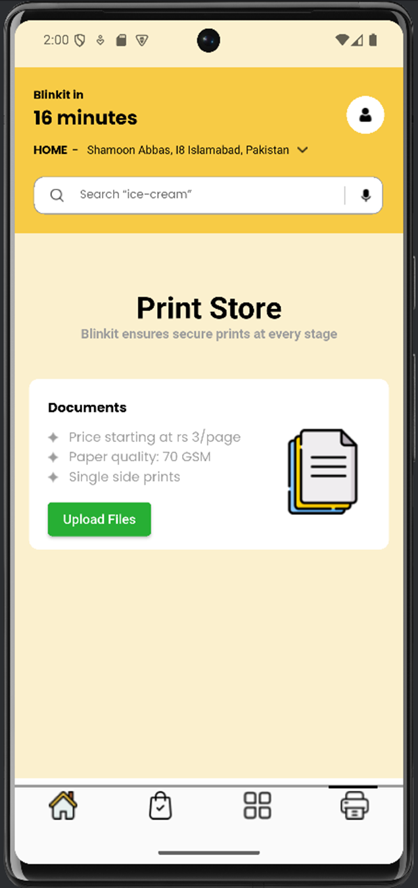

# BlinkitSeries

**BlinkitSeries** is a Flutter-based project that replicates the user interface of the Blinkit app. This project serves as a hands-on learning tool, primarily focusing on front-end development using Flutter. The repository emphasizes UI design implementation, without any backend functionality.

---

## Project Overview

- **Objective**: To provide a comprehensive UI framework based on the Blinkit app using Flutter.
- **Focus**: The project showcases the effective use of Flutter’s widgets, layouts, and responsive design capabilities.
- **Intended Audience**: Ideal for developers who wish to enhance their Flutter UI development skills.

---

## ✨ Features

- Complete user interface design modeled after the Blinkit app.
- Utilizes core Flutter widgets and best practices for mobile UI development.
- Clean, modular, and maintainable code structure for better understanding and learning.
- Fully responsive UI with adaptable layouts.

---

## 🚀 Getting Started

1. Clone this repository
2. Run `flutter pub get`
3. Launch on emulator or physical device via Android Studio or terminal

---

## 📸 Screenshots

---

## 📄 License

This project is licensed under the [MIT License](LICENSE).